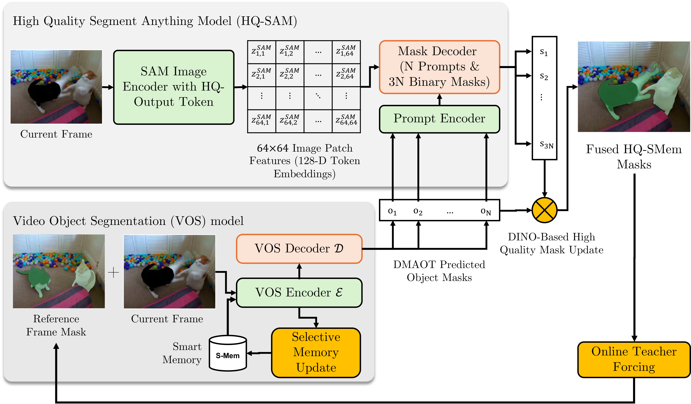

# HQ‑SAM‑Gate: IoU‑Gated Mask Refinement for DMAOT (VOTS 2024 Runner‑up)

> **DMAOT + HQ‑SAM with IoU‑gated refinement** for robust multi‑object tracking and high‑quality masks. This repo contains the exact runners we used for our **2nd‑place** VOTS 2024 entry, plus ablations (backbones, thresholds, parallelism, visualization, depth, and cycle priors).

<p align="center">
  
  <br>
  <a href="hqsam_gate_diagram.pdf">Download PDF</a> ·
  <a href="docs/diagram.html">View PDF inline (GitHub Pages)</a>
</p>


---

<p align="center">
   
   
   
   
  
</p>

## ✨ What’s inside
- **HQ‑SAM‑Gate pipeline**: **DMAOT** predicts coarse per‑object masks → **HQ‑SAM** refines them → **IoU‑based rejection** filters spurious proposals → (optional) **cycle prior** feeds high‑confidence HQ‑SAM masks back to DMAOT for the next frame.
- **Strong results**: +1.3% **Q** on VOTS test over DMAOT baseline **without any extra training**.
- **Low‑VRAM friendly**: compared to vanilla AOT (which can spike to ~80 GB on long videos), HQ‑SAM‑Gate + our runners are engineered for stability. Use the `vparallel` scripts for very long sequences.
- **Tracker zoo**: scripts for **AOT/DeAOT** with **ResNet‑50, Swin‑S, Swin‑B**, with or without **Domain‑Memory (dm)**, with **HQ‑SAM** integration, depth augmentation, visualization, and SLURM.

---

## 🗂️ Script naming & variants
Most entrypoints are explicit **one‑file‑per‑variant** for clarity.

```
python_[<backbone>_][dm_]<aot|deaot|aotl|aotb|aots|aott|r50|swinb>
       [_integrate_SAM[_hq]][_h__<NN>][_<extra>].py
```

**Legend**

| Token | Meaning |
|---|---|
| `aot`, `deaot` | AOT family or DeAOT core. |
| `aott`, `aots`, `aotb`, `aotl` | AOT‑T/S/B/L variants. |
| `r50`, `swinb` | ResNet‑50 AOTL or Swin‑B backbone. |
| `dm_` prefix | **Domain‑Memory** channel enabled. |
| `integrate_SAM` | Uses **SAM / SAM‑HQ** for refinement. |
| `hq` | High‑quality **HQ‑SAM** mode. |
| `h__NN` | IoU **rejection threshold τ** ≈ `NN/100` (e.g., `h__59` → τ≈0.59). |
| `depth` | Depth‑aware variant. |
| `cycle` | Feeds HQ‑SAM high‑confidence mask as a prior to DMAOT for t+1. |
| `vots`, `vtest` | VOTS/VOT evaluation wrappers. |
| `visualize*` | Dump overlays, embeddings, or videos. |
| `vparallel_*` | Multi‑GPU parallel flavors tuned for A100/V100. |

**Good starting points**

- `python_swinb_dm_deaot_integrate_SAM_hq_h__59.py` – strong single‑GPU runner (Swin‑B, DeAOT, Domain‑Memory, HQ‑SAM, τ≈0.59).
- `python_swinb_dm_deaot_integrate_SAM_hq_h__59_vparallel_v3_A100.py` – multi‑GPU long‑video runner.
- `python_swinb_dm_deaot_vots.py` – VOTS evaluator wrapper for submission artifacts.

---

## 🧠 How HQ‑SAM‑Gate works (overview)
1) **DMAOT** performs object‑wise propagation with long‑term memories, producing **coarse masks** for all tracked objects in frame *t*.
2) **HQ‑SAM** receives each coarse mask as a **visual prompt** and returns **multiple mask proposals** (typically 3) per object.
3) **IoU‑gated selection** chooses the proposal with the highest IoU vs. DMAOT’s mask **only if** `max IoU > τ`; otherwise the DMAOT mask is kept.
4) *(Optional)* **Cycle prior**: high‑confidence HQ‑SAM masks are passed back to DMAOT to guide predictions at *t+1*.

**Selection rule** (per object i):

```
Let S = {s1, s2, s3} be HQ‑SAM proposals.
If max_{s∈S} IoU(s, o_t,i) > τ : o_t,i ← argmax_{s∈S} IoU(s, o_t,i)
Else:                                   keep o_t,i
```

**Quality metric Q** over a dataset of N sequences (T_s frames, N_s objects):

```
Q = (1/N) * Σ_s [ (1/(T_s*N_s)) * Σ_t Σ_i IoU(o_{s,t,i}, g_{s,t,i}) ]
```

---

## 📊 Results (VOTS 2023/2024)
> Dev/test numbers reproduced from our report. Replace/add your latest if you’ve re‑run.  

**Backbone comparison (DMAOT dev split)**

| Backbone | #Params | Q (dev) |
|---|---:|---:|
| ResNet‑50 | 23M | 0.6386 |
| Swin‑S | 50M | 0.6418 |
| **Swin‑B** | **88M** | **0.6817** |

**Mask refinement ablations (on top of DMAOT, Swin‑B)**

| Method | Q (dev) | Q (test) | Notes |
|---|---:|---:|---|
| No mask‑refinement | 0.6817 | 0.6400 | DMAOT baseline |
| SAM‑B | 0.6971 | – | Light SAM refinement |
| SAM‑L | 0.7298 | 0.6187 | Larger model, no gating |
| + Rejection Sampling | 0.7326 | 0.6458 | **τ‑gated** selection |
| HQ‑SAM‑L | – | – |  |
| + Rejection Sampling | 0.7298 | 0.6513 | High‑quality token |
| + Cycle | 0.7046 | 0.6439 | Prior fed back to DMAOT |
| **HQ‑SAM‑H + Rejection** | **0.7335** | **0.6530** | **Best: +1.3% over baseline (test)** |

> Tip: tune `τ` via the `h__NN` suffix. We found **0.55–0.65** a good search range; `h__59` worked well for VOTS 2024.

---

## 🚀 Quickstart

### 1) Environment
```bash
conda create -n hqsam_gate python=3.10 -y
conda activate hqsam_gate
pip install torch torchvision torchaudio --index-url https://download.pytorch.org/whl/cu118
pip install numpy scipy opencv-python pillow tqdm einops yacs pyyaml timm decord matplotlib
# SAM / SAM-HQ (install per their repos) and place checkpoints accordingly
```

### 2) Data (VOTS)
```
DATASETS/
  VOTS2024/
    sequences/
      <seq_name>/
        imgs/000000.jpg ...
        init.json  # VOTS prompts
```

### 3) Checkpoints
```
checkpoints/
  aot/   deaot/   sam/   sam_hq/
```
Adjust paths via CLI (`--ckpt-*`) in each runner.

### 4) Single‑GPU example
```bash
python python_swinb_dm_deaot_integrate_SAM_hq_h__59.py \
  --data-root /path/to/DATASETS/VOTS2024 \
  --seq carchase \
  --output runs/vots24_swinb_deaot_dm_hq59 \
  --save-vis
```

### 5) Multi‑GPU parallel (long videos)
```bash
python python_swinb_dm_deaot_integrate_SAM_hq_h__59_vparallel_v3_A100.py \
  --data-root /path/to/DATASETS/VOTS2024 \
  --list lists/vots24_test.txt \
  --gpus 0,1,2,3 \
  --output runs/vots24_parallel
```

### 6) VOTS submission pack
```bash
python python_swinb_dm_deaot_vots.py \
  --data-root /path/to/DATASETS/VOTS2024 \
  --list lists/vots24_test.txt \
  --output runs/vots24_submit
# Zip the produced folder as per VOTS instructions
```

### 7) SLURM example
```bash
sbatch -J hqsam_gate_vots -p a100_80gb --gres=gpu:4 --cpus-per-task=16 --mem=64G \
  --wrap "python python_swinb_dm_deaot_integrate_SAM_hq_h__59_vparallel_v3_A100.py \
           --data-root /scratch/DATASETS/VOTS2024 \
           --list lists/vots24_test.txt \
           --output runs/vots24_parallel_a100"
```

---

## 🔧 Tips & gotchas
- **VRAM budgeting**: for long sequences, prefer `vparallel` variants; reduce objects per pass; lower input resolution if needed.
- **Thin structures / fine detail**: keep HQ‑SAM enabled; raise τ a bit to avoid blurry proposals.
- **Speed**: `*_vfast.py` favors throughput; AOT‑T memory‑optimized runner is also provided.
- **Debug**: `*_visualize*.py` scripts export embeddings, masks, and video previews.

---

## 📚 References & citation
Please cite the respective AOT/DeAOT, SAM/SAM‑HQ papers, and this repository.

```bibtex
@inproceedings{HQSAM_Gate_VOTS2024,
  title={HQ-SAM-Gate: IoU-Gated Mask Refinement for DMAOT},
  author={Soltani Kazemi, Elham and Toubal, Imad Eddine and Rahmon, Gani and Collins, Jaired and Mogollon, Juan and Hatuwal, Bijaya and Palaniappan, K.},
  booktitle={VOTS Challenge},
  year={2024},
  note={2nd place}
}
```

---

## 👩‍💻 Maintainer
**Elham Soltani Kazemi**  
PhD Candidate, Computer Science (Vision & AI) — University of Missouri  
Issues and PRs welcome (new backbones, memory policies, or deployment scripts).


## 🖼️ Qualitative Results (VOTS)
> Selected frames illustrating DMAOT → HQ‑SAM → IoU‑gated refinement; see captions in the PDF for details.

<p align="center"></p>

